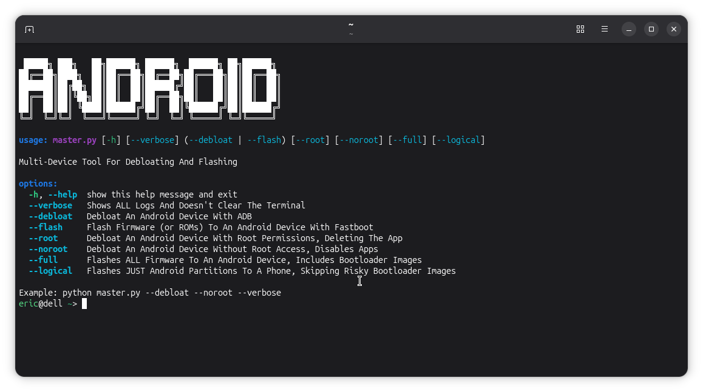

<h1 align=center>Scripts</h1>

### What is this folder?

- This folder holds all of the scripts for this repository.
    - Installers, flashers, debloaters, and combinations!

### What should I use?

- It is recommended to just use `master.py`, as it is a debloater AND a flasher, while also having other features. But if that seems like too much, the "generic" scripts are how they sound. They do what they say, nothing more, nothing less.

